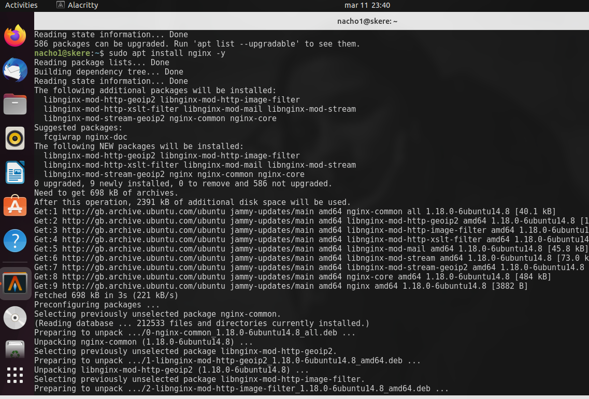
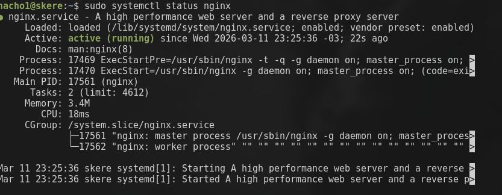
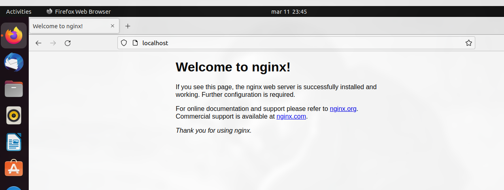
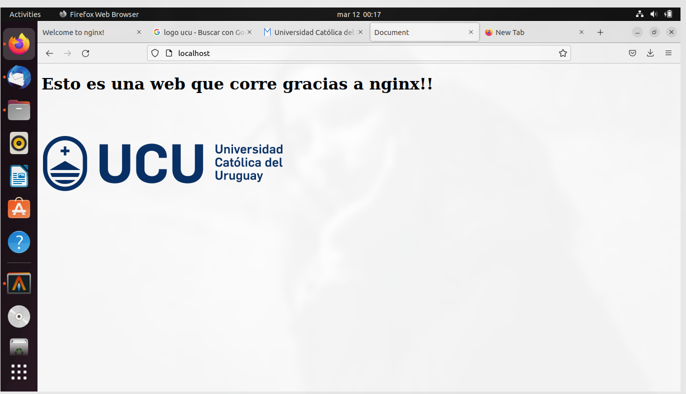

# Laboratorio 01
Estudiante: Silva, Ignacio

Universidad Católica

Asignatura: Sistemas Operativos 

Docente: Jorge Martínez

Fecha: 11 de diciembre de 2025


# Preparar el entorno
## Instalar virtualbox y ubuntu en una vm
para instalar virtual box basta con usar el siguiente comando. Además se descargó la versión de ubuntu que provee el profesor. 

```bash
sudo pacman -S virtualbox
```
una vez instalado ya puedo abrir la aplicación y configurar la vm con ubuntu.

## Ubuntu y nginx. 
Dentro de la vm. Lo primero que tenemos que realizar es instalar `nginx` mediante los repositorios de ubuntu's

`sudo apt install nginx`





Una vez instalado, compruebo el estado del servicio para ver si no hay errores usando `sudo systemctl status nginx`



y para que cada vez que prenda la vm nginx se inicialice lo marco como enable con `sudo systemctl enable nginx`. 

Y como último paso para comprobar que realmente está todo funcionando, ingreso desde `firefox` al localhost. 




## Lenvatar una web 

### Paso 1: crear el proyecto y dale permisos
Para lograr esto, hay que hacer algunos pasos. Lo primero es mover el proyecto a `/var/www/`. Una vez ahí le doy permisos totales en Users, y gruops pero no a Others. usando `sudo chmod /R 775 /var/www/lab01`

### Paso 2: configurar el proyecto como un sitio disponible.

Para esto, tenemos que levantar el servidor y configurar un puerto para el sitio con el siguiente código: 
`

server {
      listen 80;
      listen [::]:80;

      root /var/www/lab01;
      index index.html;

      server_name localhost;

      location / {
          try_files $uri $uri/ =404;
      }
  }

`


esto último debe ir en la carpeta `/etc/nginx/sites-available/` y debe ser un archivo llamda `lab01`, igual que nuestro proyecto. 

### Paso 3: crear el enlace
Sinceramente no entiendo muy bien este concepto pero se que le indica a nginx que mi proyecto que antes era uno que estaba disponible. Ahora está también activado. Para crear el enlace usamos el siguiente comando: 

`
sudo ln -s /etc/nginx/sites-available/lab01 /etc/nginx/sites-enabled/

`


### Paso 4: verificar y restartear.

Una vez realizado todos los pasos, nginx tiene una option que nos permite debugear `sudo nginx -t`. Con esto podemos comprobar si realmente los cambios que hicimos estan funcionando. 


Ahora, lo único que resta es recargar el servicio con `nginx sudo systemctl reload nginx` e ir al navegador!




