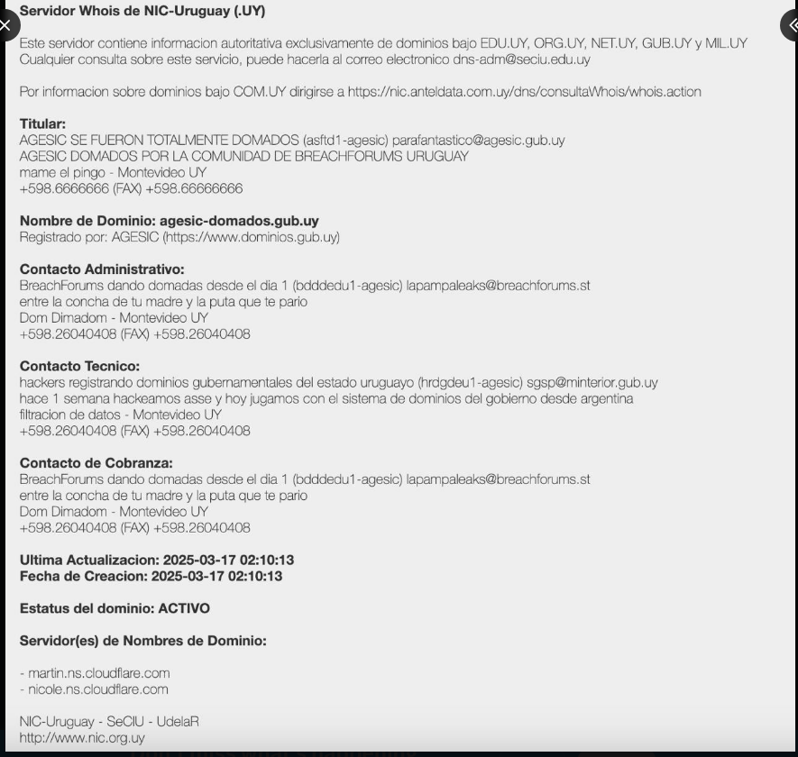

# Atacantes Locales
Para este laboratorio, decidí indagar en la escena local de `hackers` y dos de los más mediaticos son:

1. gov.eth 
2. LaPampaleaks 

La principal diferencia entre ambos es que el primero es una única persona y el segundo es uan organización que ataca con un poco más de criterio. 

## gov.eth 
Conocido por exponerse al ojo público, ha declarado en entrevistas que lo hace "just for fun". De extrema izquierda, escucha duki y a los tussiwarriors 

Aquí les dejo un video de el mismo grabando su pantalla con obs:  https://x.com/EPreve/status/1902326002874818801?ref_src=twsrc%5Etfw%7Ctwcamp%5Etweetembed%7Ctwterm%5E1902326002874818801%7Ctwgr%5E21b6af231ef92c9c48881ee0a91cd6b380261563%7Ctwcon%5Es1_&ref_url=https%3A%2F%2Fwww.montevideo.com.uy%2FCiencia-y-Tecnologia%2FDatos-expuestos-ciberataques-y-etica--quienes-estan-detras-de-los-hackeos-en-Uruguay--uc920531

El resultado de todo esto no ha sido mas que ataques al frontend de estas aplicaciones y no se ha demostrado que haya podido vulnerar las bases de datos. 

fuente: https://www.montevideo.com.uy/Ciencia-y-Tecnologia/Datos-expuestos-ciberataques-y-etica--quienes-estan-detras-de-los-hackeos-en-Uruguay--uc920531

## LaPampaLeaks 
Si comparamos ambos atacantes, se podría decir que el muchacho anterior esta aburrido en la casa. Mientras que pampaLeaks busca hacer daño. Ha hecho diversos ataques a varias instituciones uruguayas. El ministerio del Interior y Dinacia son solo algunas victicas. 

Generalmente realizar filtraciones de bases de datos. Se cree que el porpio `gov.eth` fue parte en algún momento 

En el ataque a el Ministerio se filtraron cerca de 150 millones de datos. 

### Otros achievements 
1. Doxearon a Yamandú Orsi y al director de la Agesic. Pusieron su C.I y su número de teléfono en la web de Dinancia. 
2. Demostraron que no era solo un defacing (alterar el frontend) y que realmente tenian acceso a los sistemas. Cuando el gobierno quiso desmentirlos publicaron una captura de mails internos que no pude encontrar :( 
3. Nic.com.uy y registraron dominios gubernamentales que suplantaban los origianles. 

