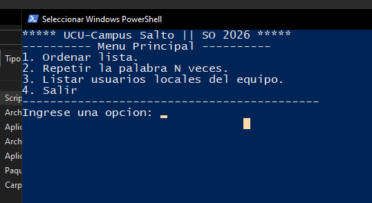
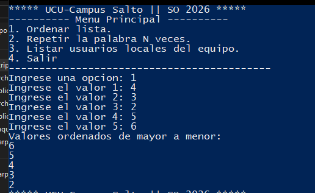
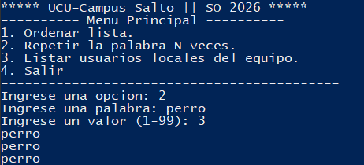
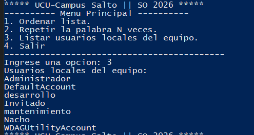

# Laboratorio 05
Estudiante: Silva, Ignacio

Universidad Católica

Asignatura: Sistemas Operativos 

Docente: Jorge Martínez

Fecha: 9 de abril de 2026

# Scripting  

## Pensar la solución 
Con el fin de ahcer el código un poco más limpio voy a implemetar las siguientes funciones:
- mostrarMenu
- OrdenarLista
- RepetirPalabra
- ListarUsuarios


### ¿Cómo se escribe una función en powershell: 

```ps1 
function NombreFuncion {

}
```

Algo particular es que si la función no tiene parámetros no hace falta escribir los `()`

## Mostrar el menú 
Para cumplir con ersto vamos a necesitar una forma de imprimir texto en pantalla: 
- Mostrar el texto en consola: `Write-Host "texto"`

### Función 

```ps1 
function MostrarMenu {
    Write-Host "***** UCU-Campus Salto || SO 2026 *****"
    Write-Host "---------- Menu Principal ----------"
    Write-Host "1. Ordenar lista."
    Write-Host "2. Repetir la palabra N veces."
    Write-Host "3. Listar usuarios locales del equipo."
    Write-Host "4. Salir"
    Write-Host "-------------------------------------------"
}
```

## Listar usuarios locales
Para esta opción necesitamos:
- Obtener los usuarios locales del equipo: `Get-LocalUser`
- Mostrar solo el nombre de cada uno: `ForEach-Object { Write-Host $_.Name }`

### Función

```ps1
function ListarUsuarios {
    Write-Host "Usuarios locales del equipo:"
    Get-LocalUser | ForEach-Object { Write-Host $_.Name }
}
```

## Repetir palabra
Para esta opción necesitamos:
- Pedir una palabra al usuario: `Read-Host "texto"`
- Pedir un número entre 1 y 99, validando que esté en ese rango: usando un bucle `do...while`
- Repetir la palabra N veces: con un `for`

### Función

```ps1
function RepetirPalabra {
    $palabra = Read-Host "Ingrese una palabra"
    do {
        $n = [int](Read-Host "Ingrese un valor (1-99)")
        if ($n -le 0 -or $n -ge 100) {
            Write-Host "El valor debe ser mayor a 0 y menor a 100."
        }
    } while ($n -le 0 -or $n -ge 100)

    for ($i = 1; $i -le $n; $i++) {
        Write-Host $palabra
    }
}
```

## Ordenar lista
Para esta opción necesitamos:
- Pedir 5 valores al usuario: `Read-Host "texto"`
- Guardarlos en un array: `$array = @()`
- Agregarle elementos al array: `$array += valor`
- Ordenarlos de mayor a menor: `$array | Sort-Object -Descending`
- Mostrar cada valor: `ForEach-Object { Write-Host $_ }`

### Función

```ps1
function OrdenarLista {
    $valores = @()
    for ($i = 1; $i -le 5; $i++) {
        $valores += [int](Read-Host "Ingrese el valor $i")
    }
    $ordenado = $valores | Sort-Object -Descending
    Write-Host "Valores ordenados de mayor a menor:"
    $ordenado | ForEach-Object { Write-Host $_ }
}
```

## Main
Para el programa principal necesitamos:
- Un bucle que se repita hasta que el usuario elija salir: `do...while`
- Mostrar el menú en cada iteración: llamando a `MostrarMenu`
- Leer la opción ingresada: `Read-Host`
- Ejecutar la función correspondiente según la opción: con `switch`

### Código principal

```ps1
do {
    MostrarMenu
    $opcion = Read-Host "Ingrese una opcion"

    switch ($opcion) {
        "1" { OrdenarLista }
        "2" { RepetirPalabra }
        "3" { ListarUsuarios }
        "4" { Write-Host "Saliendo..." }
        default { Write-Host "Opcion invalida. Intente de nuevo." }
    }

} while ($opcion -ne "4")

```


# Resultados y capturas de pantalla 
## Menú 



## Ordenar lista 



## Repetir palabra 



## Listar usuarios 




