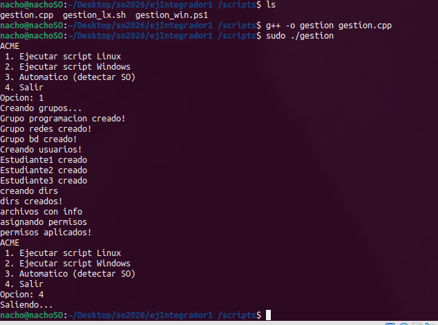
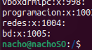
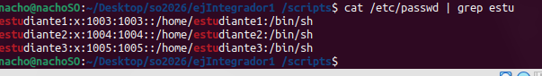
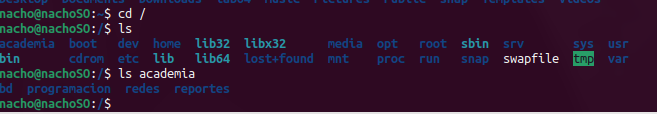

# Tarea 03
Estudiante: Silva, Ignacio

Universidad Católica

Asignatura: Sistemas Operativos 

Docente: Jorge Martínez

Fecha: 14 de mayo de 2026

## Análisis previo 
    Se piden las siguientes features: 
- Gestionar grupos
- Generar estructuras de directorios
- Integrarse con archivos generados por scripts
- Procesar información desde C++

y los siguientes scripts: 
- gestion_lx.sh
- gestion_win.ps1 
- app en c++

## Entidades reconocidas: 
### Estudiante
- Usuario 
- Grupo 
- Carpeta Personal 
- Archivo de info. 

# Capturas!

## menu en c ejecutandose
 

## grupos creados
 

## usuarios creados en linux
 

## dirs creados en Linux
 

