# Laboratorio 01
Estudiante: Silva, Ignacio

Universidad Católica

Asignatura: Sistemas Operativos 

Docente: Jorge Martínez

Fecha: 8 de abril de 2026

# Creación del usuario 
## Ubuntu 
### Alternativa gui
Para crear un usuario mediante la gui de Gnome debemos usar la aplicación Users.

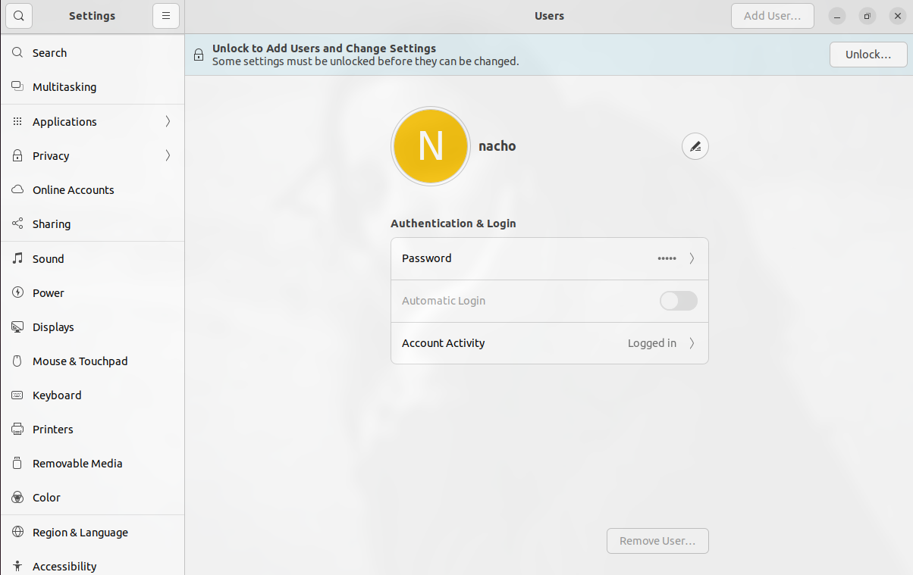

Como se observa en la sc anterior, como ejecute la aplicación desde mi usuario, no tengo permisos para crear una nuevo por lo que debo presionar el botón `unlock`. Una vez autenticado mi usuario ya puedo crear un usuario. 

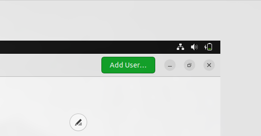

Al presionarlo, vemos la siguiente ventana emergente 

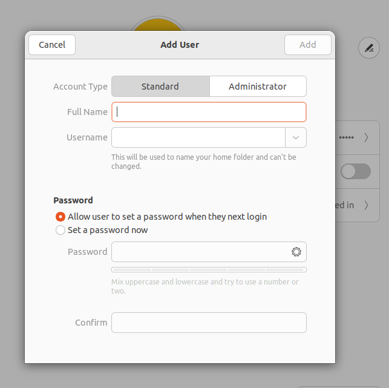

mi contraseña para esta ocasión fue Nacho324! (la escribo aca aunque sea inseguro pq me voy a olvidar).

una vez creado los usuarios se debería ver algo como esto en la misma pestaña: 

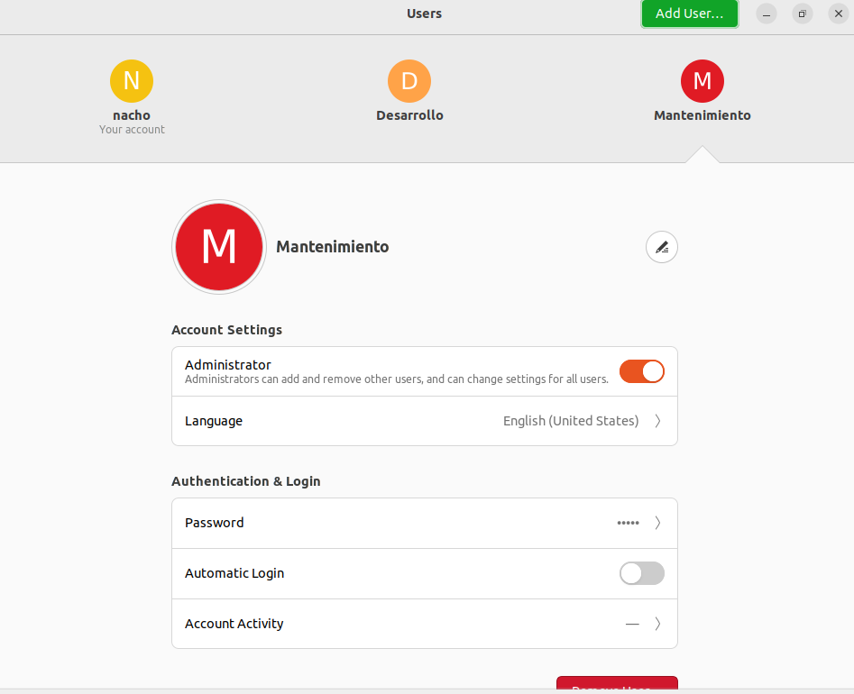


## Windows 10 

### DISCLAIMER 
1. Voy a referirme como `interfaz nueva` a la interfaz introducida en windows 10 y como `interfaz vieja` a la clásica con menúes blancos mas al estilo `Windows xp`

#### Alternativa GUI nueva 
En windows, el proceso es algo engorroso porque desde la `interfaz nueva` ya que quieren forzarnos a crearnos una cuenta de microsoft para ser un usuario mas de sus servicios, por lo que en la ventada en `configuración` en la pestaña `cuentas` en la sección de `Familia y otros usuarios`, tenemos un botón para agregar `otra persona` a este equipo y nos aparece el la siguiente ventana. 

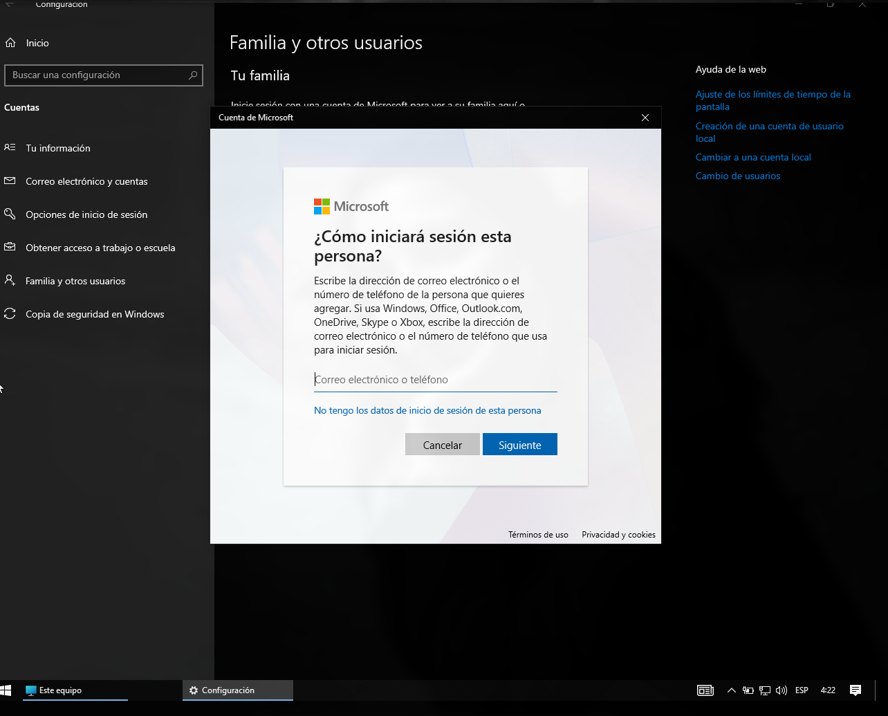

pulsando en el botón `No tengo los datos de inicio de sesión de esta persona` nos lleva a lo siguiente:

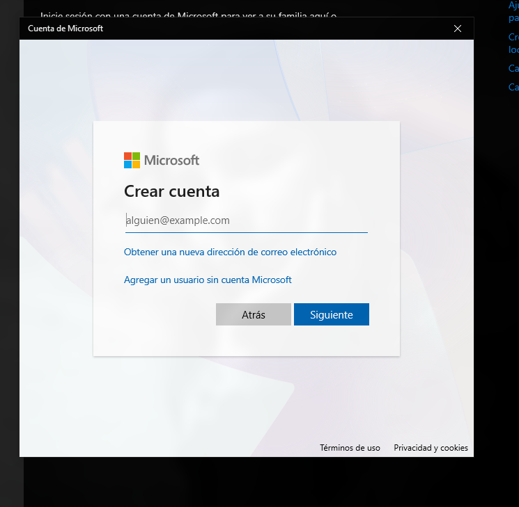

y recién aquí nos da la opción de `Agregar un usuario sin cuenta Microsoft`. Al clickar, vemos lo siguiente: 

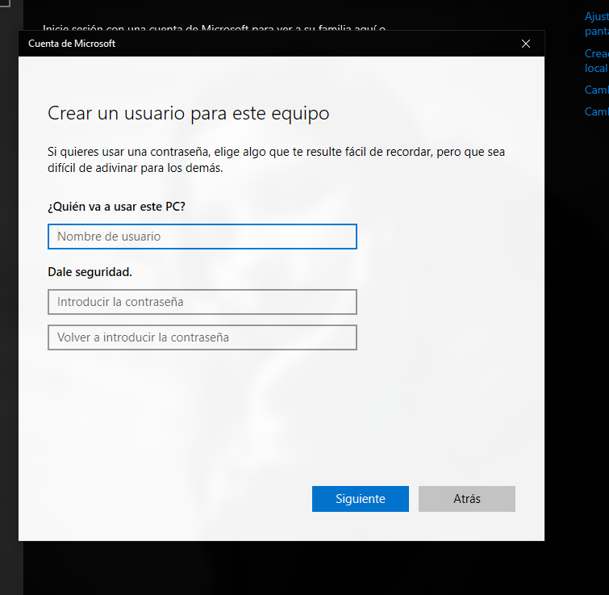

Aquí es donde voy a crear el usuario `desarrollo`

#### Alternativa GUI vieja (Panel de control)

Desde el `panel de control` podemos ir a `Cuentas de usuario` y denuevo a `Cuentas de usuario`
y clickar en `Administrar otra cuenta` entre otras opciones 

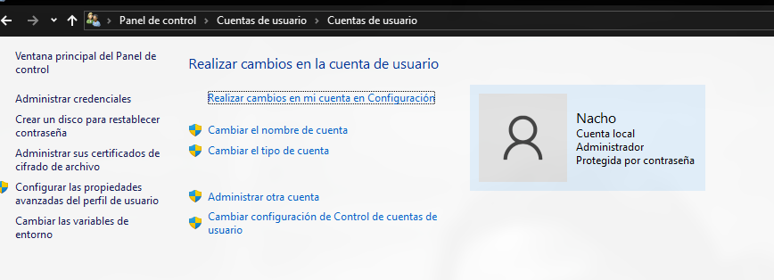

al presionar nos muestra esto: 

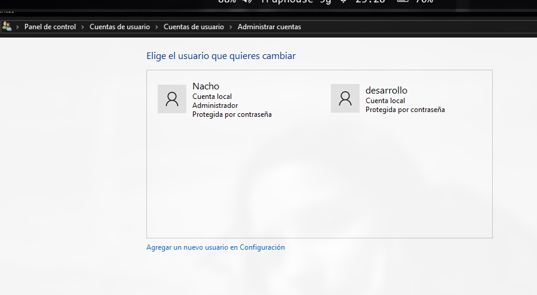

y sorprendentemente al clickar `Agregar un nuevo usuario en configuración` nos lleva a la interfaz nueva. 

Lo que si no podemos hacer en la GUI nueva es cambiar el tipo de cuenta. 

#### Cuenta Mantenimiento 

Para lograr agregar la cuenta mantenimiento, primero creo una cuenta local como se detalla anteriormente y luego me dirigo a `Panel de control\Cuentas de usuario\Cuentas de usuario\Administrar cuentas\Cambiar una cuenta` y clicko en mantenimiento. Aquí tendré el siguiente menú: 

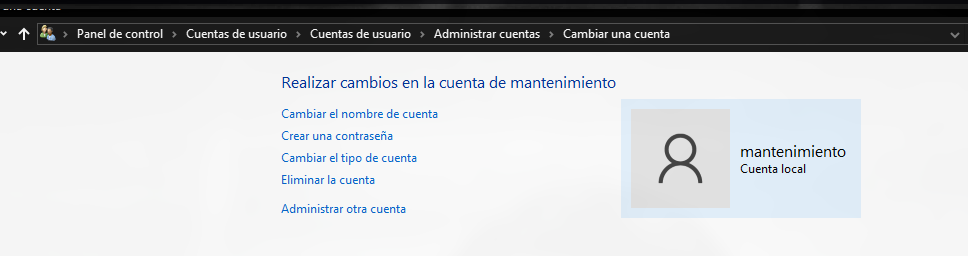

y solo seleccionamos en Administrador. 

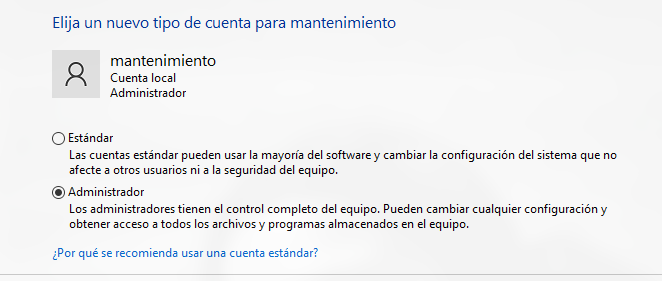

### Alternativa Cli

Como es de esperarse, realizar esto ya sea un powershell o cmd es mucho mas fácil.

Para crear un usuario desde la terminal de Windows voy a usar el comando `net user`. Hay que abrir PowerShell o CMD como administrador.

```bash
net user Desarrollo Nacho324! /add
```

En este comando, `Desarrollo` es el nombre del usuario y `Nacho324!` es la contraseña. El parámetro `/add` indica que quiero crear un nuevo usuario.

Para verificar que el usuario fue creado correctamente puedo listar todos los usuarios:

```bash
net user
```

O ver información específica del usuario:

```bash
net user Desarrollo
```


# Crear un grupo de usuarios.
## Ubuntu 
### Alternativa por gui
De manera nativa en nuestra instalación, la sección de la configuración que usamos anteriormente no es suficiente ya que no nos deja gestionar groups. Para eso, voy a instalar el paquete `gnome-system-tools` en el que exite una aplicaición llamada `users and groups`

para instalarla ejecutamos el siguiente comando `sudo apt install gnome-system-tools`. Habiendo previamente usado `sudo apt update` 

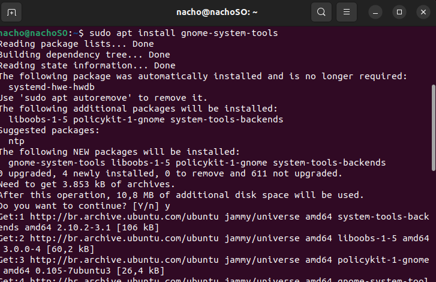

Una vez instalado, tendremos la siguiente app: 

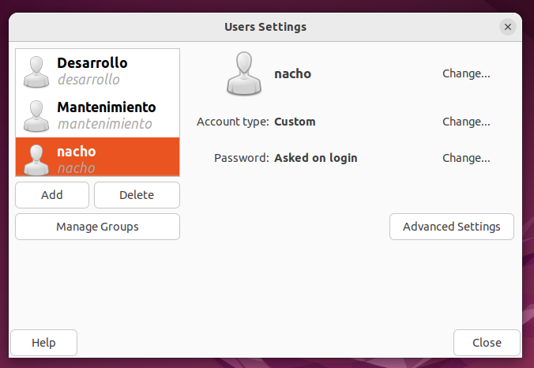

En la opción de `manage groups` tenemos un crud o abm de los grupos de usuarios, por lo que aquí podremos crear el grupo `desarrollo`. Incluso podemos definir que usuarios estarán dentro de este grupoen la misma interfaz. 

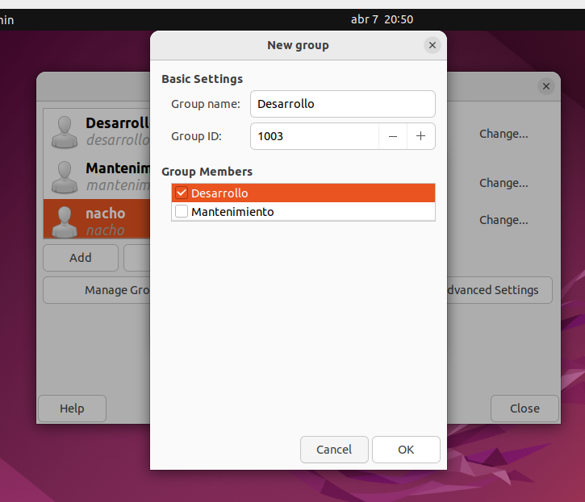

### Alternativa mediante cli

Para realizar la misma acción dede nuestra terminal, simplemente utilizamos los siguientes comandos `sudo addgroup desarrolo`

y para agregar al usuario `Desarrollo` al grupo `desarrolo` usamos: `sudo usermod -aG desarrollo Desarrollo` 

En este último comando, el primer nombre corresponde al grupo y el segundo al usuario. El parámetro aG hace referencia a "append" y la G mayúscula refiere a que es un grupo `suplementario` o `extra`, estos son grupos adicionales que nos dan permisos que necesitamos para x o y. Por otro lado, un usuario tiene tambien su grupo principal que se gestiona con el mismo parametro pero no minúscula. El grupo principal define a que grupo pertenecen los archivos que genere el usuario. 


### Windows 
#### Alternativa Gui

Aunque un poco más escondida, la opción existe, aunque solo con la interfaz vieja. en `Administración de Equipos` en la sección de `herramientas del sistema` vemos la opción de `Usuarios y grupos locales`. Al clickar vemos lo siguiente: 

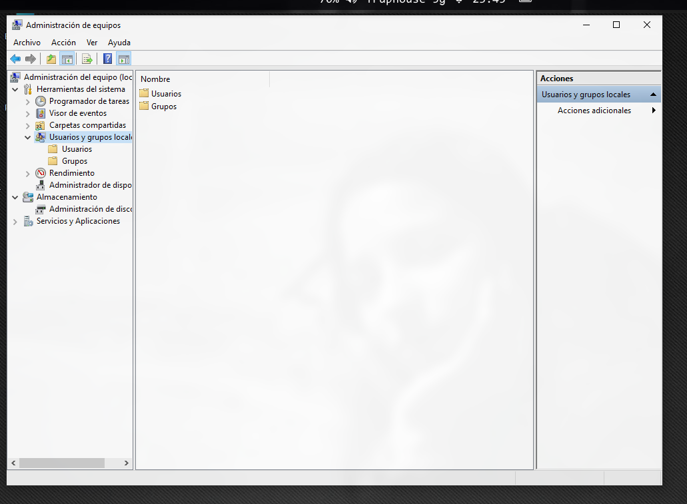

si ingresamos a `grupos` tenemos la opción de crear un grupo nuevo: 

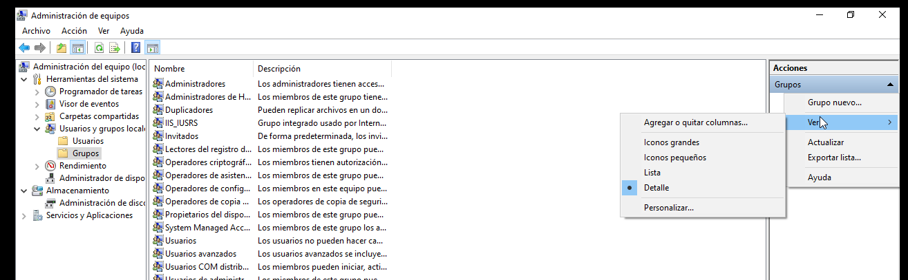

Acto seguido, tendremos que rellenar un formulario y agregar los usuarios que queremos que sean parte:

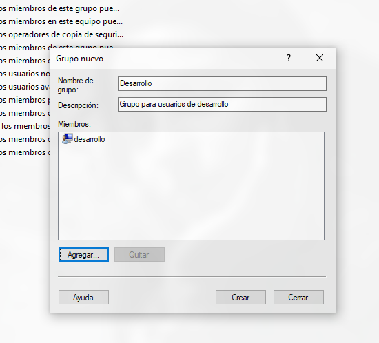

Algo a desacatar es que los grupos y usuarios parecen no ser case-Sensitive en windows y al intentar crear el grupo `Desarrollo` me dió un error dicienco que este ya existía, por lo que lo nombre `Desarrollo1` .


#### Alternativa Cli

Como es usual, la terminal nos facilita mucho las cosas. Para crear un grupo desde PowerShell o CMD como administrador voy a usar el comando `net localgroup`.

```bash
net localgroup Desarrollo1 /add
```

Este comando crea un grupo local llamado `Desarrollo1`. El parámetro `/add` indica que quiero crear un nuevo grupo.

Para agregar un usuario al grupo uso:

```bash
net localgroup desarrollo1 desarrollo /add
```

En este comando, el primer `desarrollo1` es el nombre del grupo y `desarrollo` es el nombre del usuario que quiero agregar. Similar a Ubuntu, aquí también estoy agregando el usuario a un grupo suplementario.

Para verificar que el grupo fue creado y ver sus miembros puedo usar:

```bash
net localgroup desarrollo1
```

Este comando me va a mostrar información del grupo incluyendo sus miembros.

Para listar todos los grupos locales:

```bash
net localgroup
```


