# Laboratorio 01
Estudiante: Silva, Ignacio

Universidad Católica

Asignatura: Sistemas Operativos 

Docente: Jorge Martínez

Fecha: 9 de abril de 2026

# 1. Crear estructura de directorios 
## a. Windows (desde el cmd)
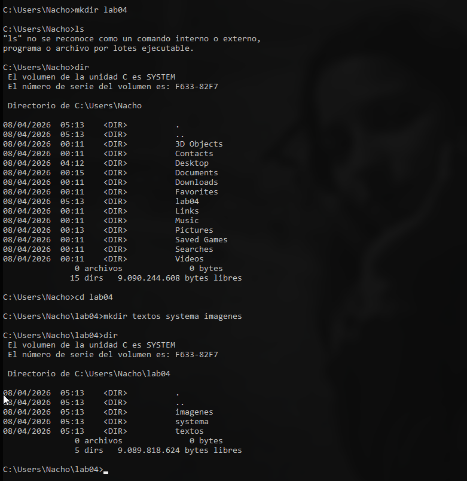

## b. Ubuntu 
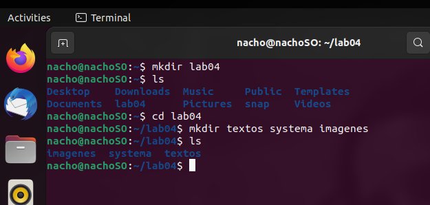


# 2. Búsqueda recursiva windows 

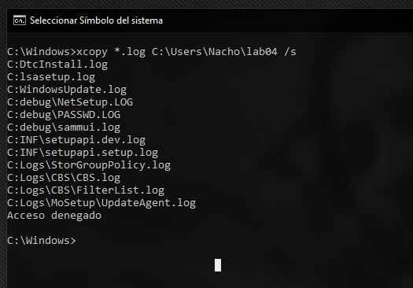

Cuanto búsqué en system32 no encontré ningún `.log` ya que la instalación de windows la realicé nuevamente hace poco y probablemente no se hayan llegado a genera, por lo que fuí a la carpeta Windows donde estaba seguro de que si los había. 

# 3.Búsqueda recursiva linux 

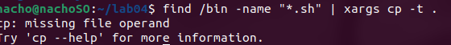

Igual que el anterior, no encuentro archivos `.txt`. El comando funciona de la sigueinte manera: 

```bash
find /bin -name "*.txt" | xargs cp -t .
```

- `find /bin -name "*.txt"` busca recursivamente en `/bin` todos los archivos con extensión `.txt` y lista sus rutas
- `|` pasa esa lista como entrada al siguiente comando
- `xargs` toma cada línea de esa entrada y la convierte en argumentos del comando `cp`
- `cp -t .` copia los archivos al directorio actual (`.`), donde `-t` indica el destino para que `xargs` pueda agregar los archivos al final

Dado que `xargs` no puede lenvatar nada del pipe, ya que no se encontraron archivos, salta el error. 


# 4. Crear archivos 

## a. Windows 
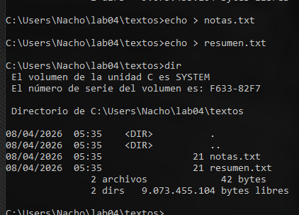

## b. Ubuntu 
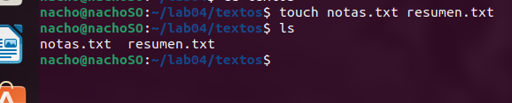


# 5. Añadir lineas

## a. Widnows 

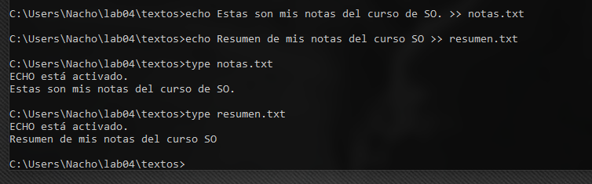

## b. ubuntu 

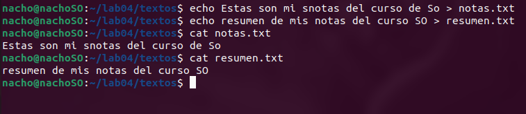


# 6. Renombar carpetas
Tanto en windows como en linux no existe un comando `rename` sino que se realiza esta operación se realiza con el comando `mv` y `move` respectivamente. 

## a. Windows 
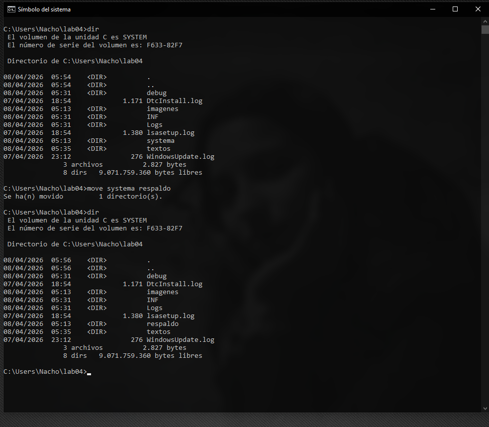

## b. Ubuntu

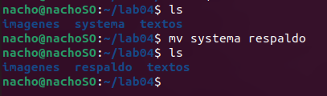


# 7. Copiar carpeta a otra 

## a. Windows 
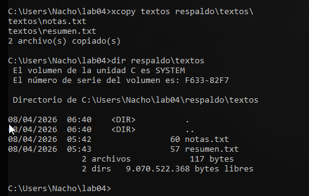

## b. Ubuntu 

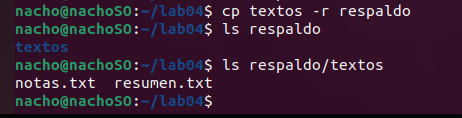

### Observación 

En windows no pude no escribir `Respaldo/textos` ya que si no lo hacía así, solo copiaba los archivos dentro dle directorio pero no el directorio. Linux entiende la misma operación de manera mas intuitiva y sobreentiende de que si copias un directorio queres que este aparezca en el dir de destino. 


# 8. mover textos a imagenes 

## a. Windows 
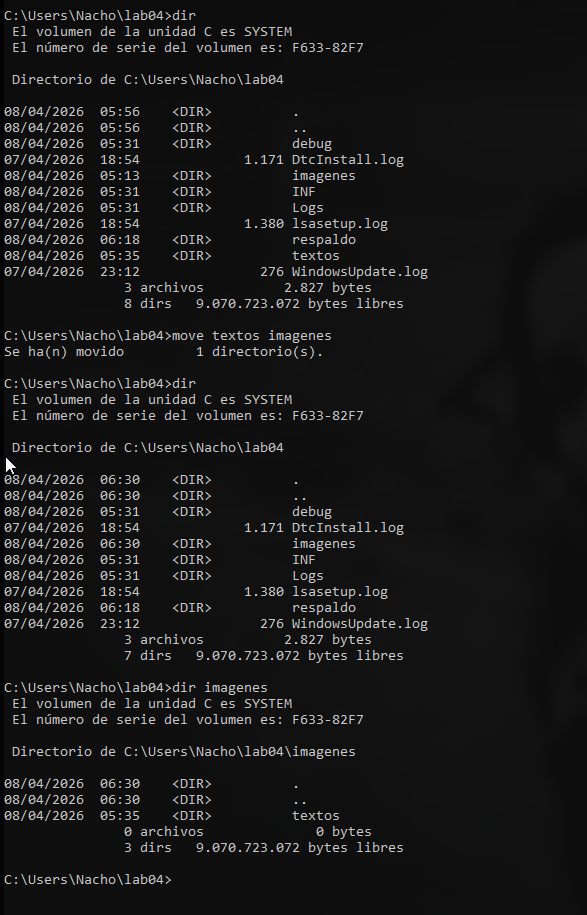

## b. Ubuntu  
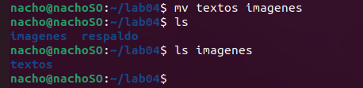


