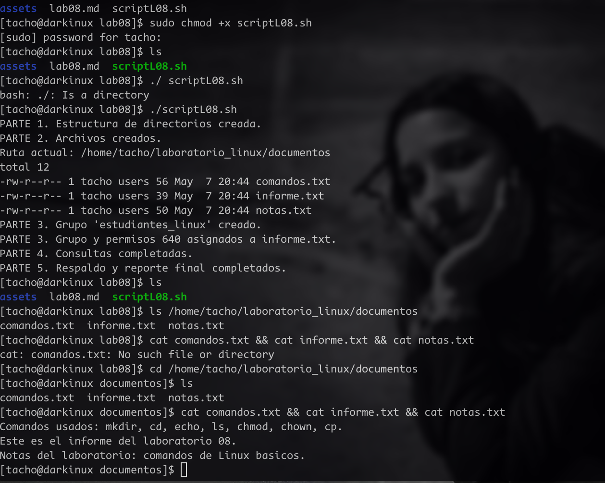

# Laboratorio 08
Estudiante: Silva, Ignacio

Universidad Católica

Asignatura: Sistemas Operativos 

Docente: Jorge Martínez

Fecha: 07 de mayo  de 2026

## Parte 1. Estructura de directorios

El script crea los directorios `documentos/`, `respaldos/`, `logs/` y `sistema/` dentro de `~/laboratorio_linux/`, y registra la fecha y hora de inicio en `logs/ejecucion.log`.

## Parte 2. Archivos y navegación

Se ingresa a `documentos/`, se crean los archivos `informe.txt`, `notas.txt` y `comandos.txt` con contenido via `echo`. Se muestra la ruta actual con `pwd` y el listado con `ls -l`.

## Parte 3. Usuarios, grupos y permisos

Se verifica si el grupo `estudiantes_linux` existe antes de crearlo. Se cambia el grupo propietario de `informe.txt` y se asignan permisos `640` 

## Parte 4. Manipulación de consultas

Se copian `/proc/cpuinfo` y `/proc/meminfo` a `sistema/`. Se envía un mensaje a `/dev/null`. Cada acción queda registrada en `logs/ejecucion.log`.

## Parte 5. Respaldo y reporte final

Se copian todos los `.txt` de `documentos/` a `respaldos/`. Se genera `reporte_final.txt` con: usuario, ruta, fecha, archivos creados, permisos de `informe.txt`, y confirmación de acceso a `/proc` y `/dev/null`.

## screenshot output: 
 

