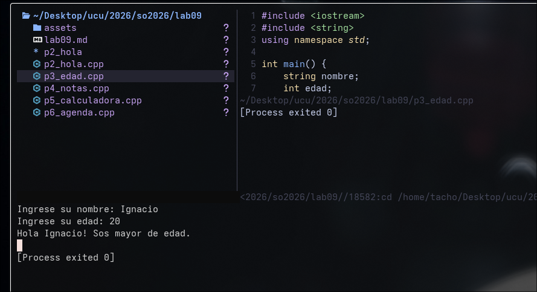
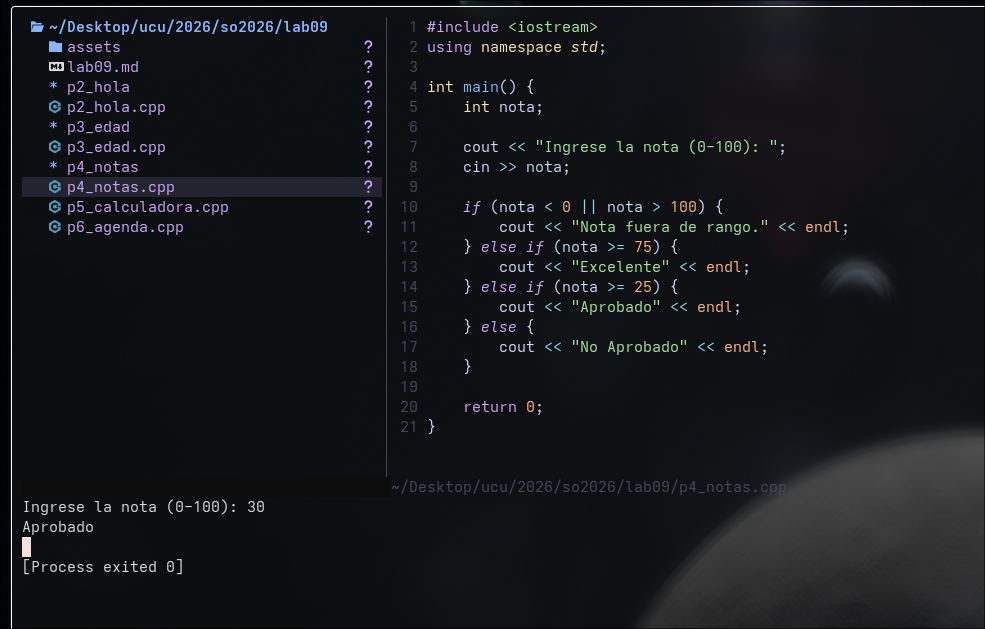
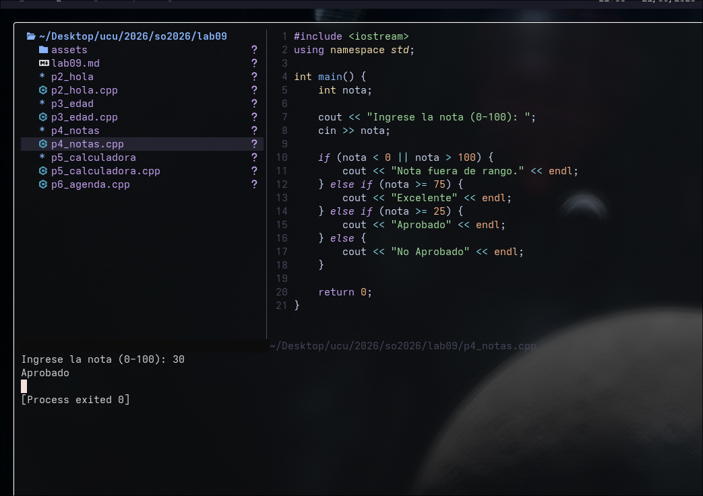
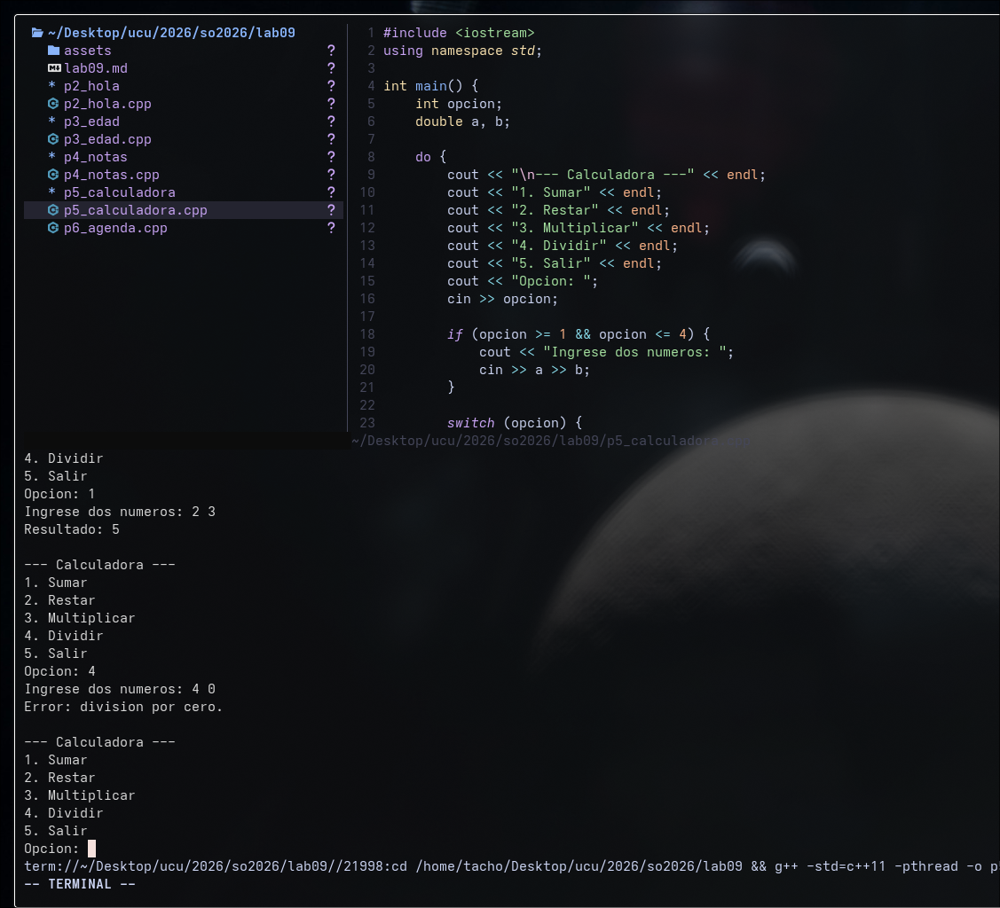
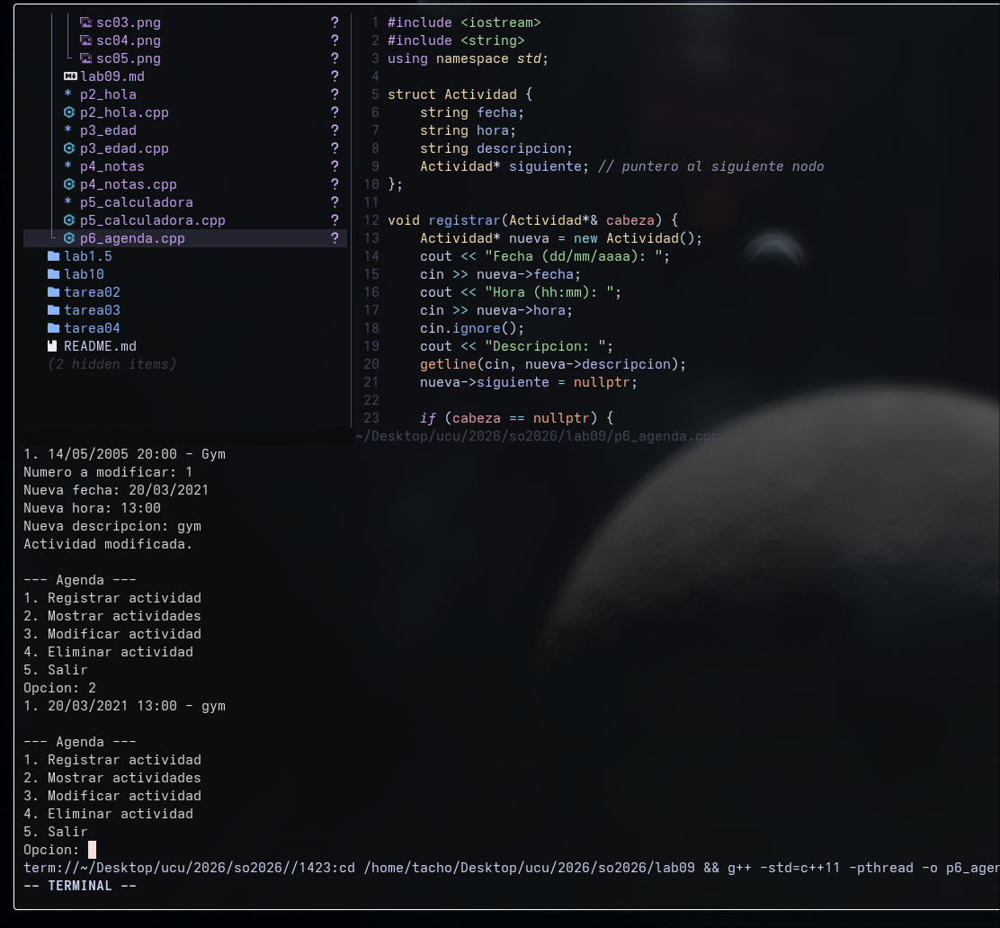

# Laboratorio 09
Estudiante: Silva, Ignacio

Universidad Católica

Asignatura: Sistemas Operativos 

Docente: Jorge Martínez

Fecha: 21 de mayo de 2026

## Parte 2 - Hola Mundo

Imprime el mensaje requerido por consola. Ver `p2_hola.cpp`.

## Parte 3 - Edad

Pide nombre y edad. La validación de edad negativa la hice con un `do while` que repite el pedido hasta que el usuario ingrese un valor válido. Después un `if/else` simple determina si es mayor o menor de edad (corte en 18). Ver `p3_edad.cpp`.

## Parte 4 - Notas

Recibe una nota entre 0 y 100 y la clasifica. Primero valido que esté en rango, después uso `else if` en cascada de mayor a menor para evitar rangos superpuestos. Ver `p4_notas.cpp`.

## Parte 5 - Calculadora

Menú con `switch` dentro de un `do while` para que no se cierre después de cada operación. Maneja división por cero antes de operar. Ver `p5_calculadora.cpp`.

## Parte 6 - Agenda

La más compleja. Implementé una lista enlazada con punteros, donde cada nodo es una `struct Actividad` que guarda fecha, hora, descripción y un puntero al siguiente nodo. Tiene cuatro funciones: `registrar`, `mostrar`, `modificar` y `eliminar`. Cada una recorre la lista con un puntero `actual` que va saltando de nodo en nodo. Al salir libero toda la memoria con `delete`. Ver `p6_agenda.cpp`.

