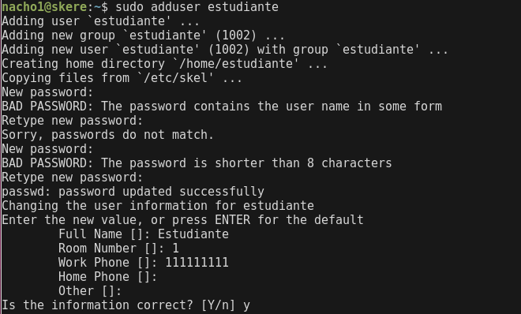
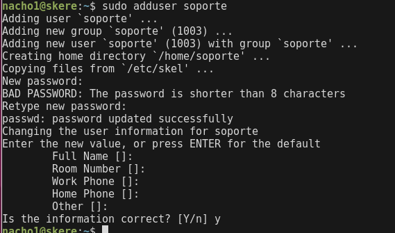
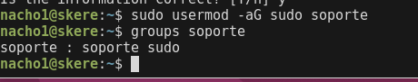
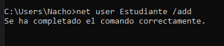
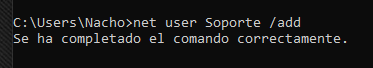
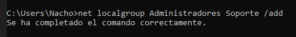

# Laboratorio 01
Estudiante: Silva, Ignacio

Universidad Católica

Asignatura: Sistemas Operativos 

Docente: Jorge Martínez

Fecha: 12 de diciembre de 2026

## Linux 
Para empezar, el lab nos pide crear 2 usuarios en `ubuntu`. Para hacerlo se utiliza el siguiente comando: 

`
adduser
`

El mismo nos va a ir pidiendo datos hasta crear el usuario.

### Usuario Estudiante

password: est123

### Usuario Soporte

password: sup123

A este segundo usuario debemos darle permisos para usar sudo. 

` sudo usermod -aG sudo [nombre]`

Con el parametro aG (add Grup) anañadimos al usuario a un grupo específico. 

Luego de ejecutar el comando compruebo usando `groups soporte`

## Windows 

Una vez realizada la instalación. Podemos empezar a crear los usuarios utilizando `net user`

### Usuario Estudiante

### Usuario Soporte 

Como en linux, al usuario soporte deberíamos agregarlo al grupo de administradores. 

Para eso usamos la siguiente sintaxis:

`net localgroup Administradores nombre_usuario /add`

## Levantar sv web en Windows 
Como no puedo instalar nada porque le di el mínimo espacio posible, voy a usar una alternativa nativa de windows. 

Se puede emplear el powershell como un sv http básico mediante un script `ps1`

