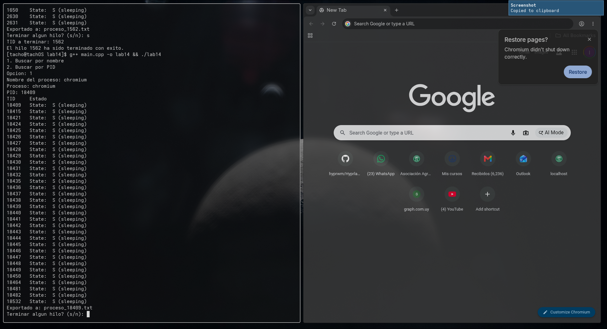
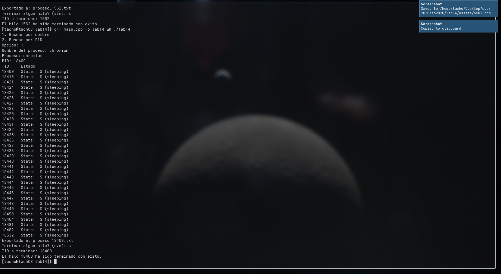
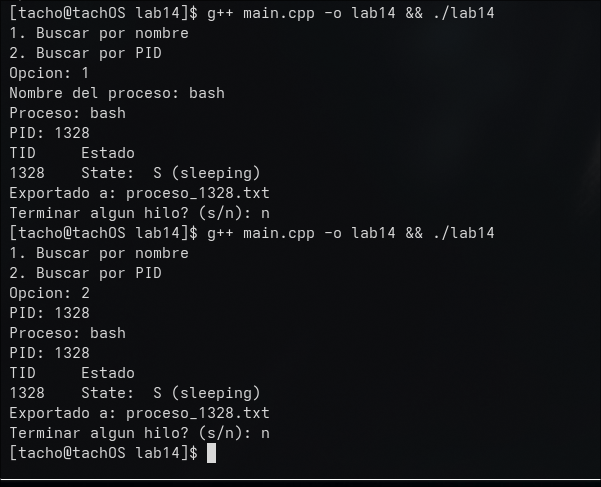
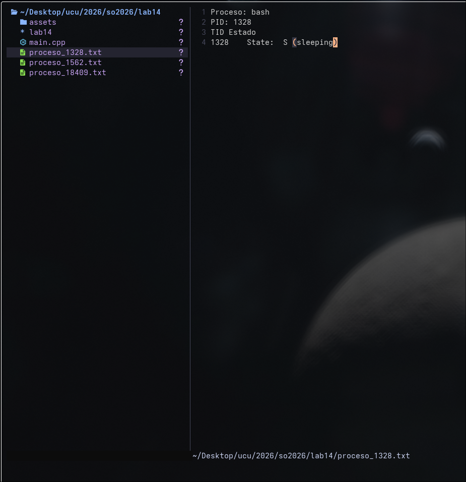
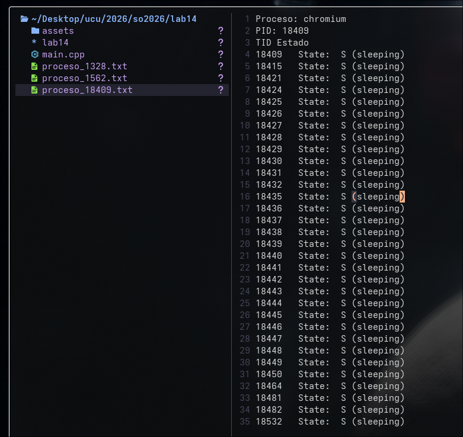

# Laboratorio 14
Estudiante: Silva, Ignacio

Universidad Católica

Asignatura: Sistemas Operativos

Docente: Jorge Martínez

Fecha: 26 de mayo de 2026

## Parte 1 - Exploración del proceso

El programa busca un proceso por nombre o por PID leyendo `/proc/`. Para el nombre uso `pgrep` via `popen`, que ejecuta un comando del sistema y devuelve su salida. Una vez encontrado el PID, lista los TIDs desde `/proc/<PID>/task/` y el estado de cada hilo desde `/proc/<PID>/task/<TID>/status`. Todo se exporta a un `.txt` con el mismo formato que se muestra en pantalla.

Buscando chromium por nombre:

## Parte 2 - Gestión de hilos

El usuario elige un TID de la lista y el programa lo termina usando la syscall `tgkill`, que a diferencia de `kill` apunta a un hilo específico dentro de un proceso. Si la syscall devuelve 0 el hilo fue terminado, si devuelve -1 hubo un error.

Chromium terminado:

## Búsqueda por PID y por nombre

Encontrando bash por nombre y por ID:

## Archivos exportados

Archivo generado al inspeccionar chromium:

Archivo generado al inspeccionar bash:

