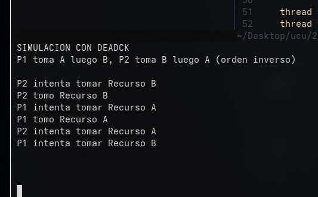
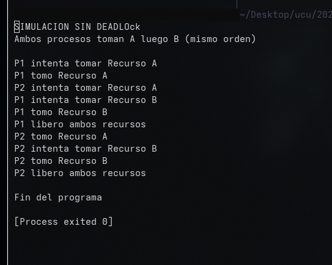
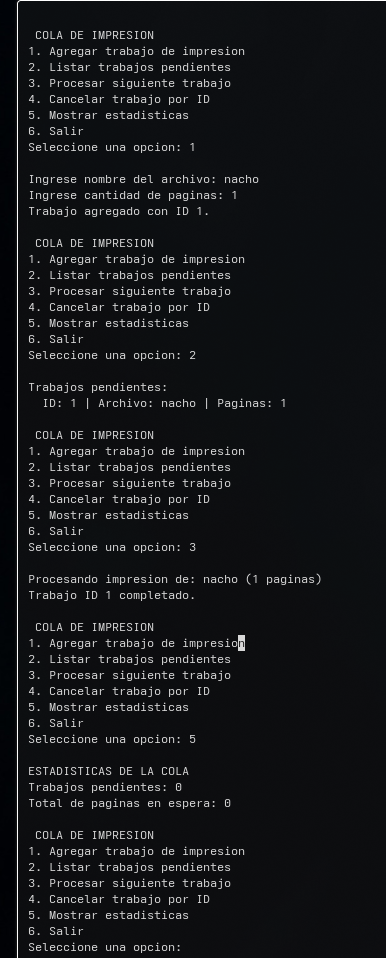

# Laboratorio 16
Estudiante: Silva, Ignacio

Universidad Católica

Asignatura: Sistemas Operativos

Docente: Jorge Martínez

Fecha: 18 de junio de 2026

## Ejercicio 1  Deadlocks

Se simulan dos procesos (hilos) que compiten por dos recursos exclusivos (mutex). Se implementaron dos versiones: una que provoca deadlock y otra que lo evita.

### Versión con deadlock (`deadlock_con.cpp`)

P1 toma Recurso A y luego intenta tomar Recurso B. P2 toma Recurso B y luego intenta tomar Recurso A. Al adquirir los recursos en orden inverso, se produce una espera circular y el programa queda bloqueado indefinidamente.

### Versión sin deadlock (`deadlock_sin.cpp`)

Ambos procesos toman los recursos en el mismo orden: primero Recurso A y luego Recurso B. Esto rompe la condición de espera circular y el programa termina correctamente.

El deadlock se produce cuando se cumplen las cuatro condiciones de Coffman simultáneamente:

1. **Exclusión mutua**: cada mutex solo puede ser tomado por un hilo a la vez.
2. **Retener y esperar**: cada hilo retiene un recurso mientras espera el otro.
3. **No apropiación**: el sistema no puede quitarle un mutex a un hilo por la fuerza.
4. **Espera circular**: P1 espera lo que tiene P2 y P2 espera lo que tiene P1.

Al hacer que ambos procesos soliciten los recursos en el mismo orden, se elimina la espera circular y el deadlock no puede ocurrir.

## Ejercicio 2  Cola de impresión (`cola_impresion.cpp`)

Se simula una cola de spooling administrada por el sistema operativo. La impresora es un dispositivo lento (en el mejor de los casos), por lo que el SO organiza los trabajos en una cola FIFO.

El programa permite:

- Agregar trabajos con nombre de archivo y cantidad de páginas.
- Listar los trabajos pendientes.
- Procesar el siguiente trabajo (FIFO).
- Cancelar un trabajo por su ID.
- Mostrar estadísticas (cantidad de trabajos y total de páginas en espera).

El programa representa los conceptos de **spooling** y **cola de I/O** porque múltiples procesos envían trabajos a un dispositivo lento (impresora) y el SO los atiende en orden de llegada, evitando conflictos de acceso concurrente.
