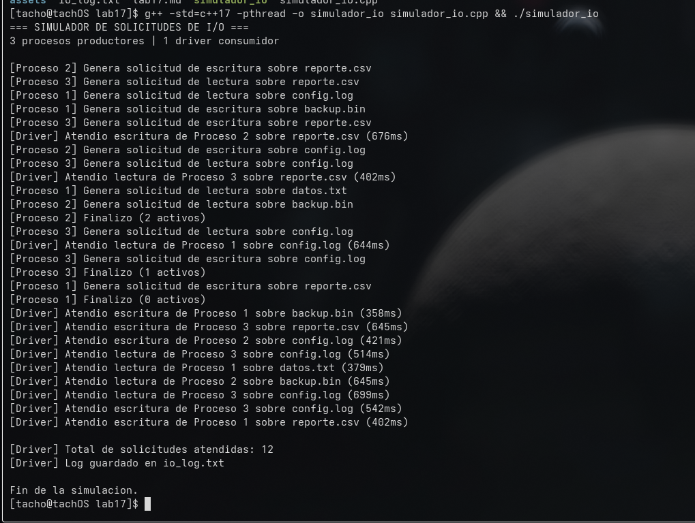

# Laboratorio 17
Estudiante: Silva, Ignacio

Universidad Católica

Asignatura: Sistemas Operativos

Docente: Jorge Martínez

Fecha: 23 de junio de 2026

## Simulador de solicitudes de I/O (`simulador_io.cpp`)

El programa simula un sistema operativo atendiendo solicitudes de lectura y escritura generadas por varios procesos. Tiene 3 hilos productores que representan procesos y 1 hilo consumidor que representa el driver del dispositivo.

Cada productor genera entre 3 y 5 solicitudes aleatorias (lectura o escritura sobre distintos archivos) con pausas entre medio para simular tiempos reales. Las solicitudes se meten en una cola compartida protegida con `mutex` y `condition_variable`. El consumidor las va sacando en orden de llegada, simula el tiempo que tarda el dispositivo en atenderlas y las registra en un archivo `io_log.txt`.

La estructura `SolicitudIO` tiene el id del proceso, tipo de operación, archivo destino y tiempo estimado de atención.

### Cómo se relaciona con el SO

Los 3 productores y el consumidor corren como hilos con `std::thread`, y el planificador del SO decide el orden de ejecución, por eso el resultado cambia entre corridas. La cola compartida vive en RAM y se protege con `mutex` para que no se corrompa cuando varios hilos intentan acceder al mismo tiempo. El `condition_variable` hace que el consumidor se duerma cuando no hay solicitudes en vez de estar preguntando en un loop infinito, ahorrando CPU. El log en disco con `ofstream` representa la persistencia en el sistema de archivos. Y el `sleep_for` simula el tiempo real que tardaría un dispositivo lento en completar una operación de I/O.

### Ejecución

### Preguntas

**¿Por qué el orden de atención puede cambiar entre ejecuciones?**

Porque el planificador del SO decide cuándo darle CPU a cada hilo y eso depende del contexto del sistema, las prioridades y los tiempos de sleep aleatorios dado el codigo que se realizo en el ej. No hay garantía de que el Proceso 1 genere su solicitud antes que el Proceso 3, ni de que el consumidor la tome en el mismo instante. cada ejecución va a ser distinta de la anterior porque es un simulador. 

**¿Qué pasaría si quitamos el mutex?**

Varios hilos podrían leer y escribir la cola al mismo tiempo haciedo que explote todo. Podría pasar que dos productores hagan push a la vez y se corrompa la estructura interna de la queue, o que el consumidor haga pop de una solicitud que todavía no se terminó de escribir saltando una interrupcion del sistma. 

**¿Por qué el consumidor debe esperar y no consultar la cola en bucle infinito?**

Si el consumidor pregunta todo el tiempo si hay algo en la cola, consume CPU innecesariamente. Usando `condition_variable` el hilo se duerme y el SO lo saca de la cola de listos, liberando el procesador para los productores u otros procesos. Solo se despierta cuando un productor le avisa que hay trabajo nuevo.

La analogía sería, para que mirar todo el tiempo si aparece algo en la heladera, si puedo pedirle a alguien mas que me diga cuando haya comida 

**¿Qué parte se parece al driver?**

En mi opinión el hilo consumidor. Recibe solicitudes de I/O de los procesos, las atiende de a una en orden de llegada y reporta el resultado. fuera de un simulador como este, el driver hace mas o menos lo mismo, traduce las solicitudes genéricas del kernel en operaciones específicas del dispositivo y las ejecuta secuencialmente.

**¿Dónde aparecen las interrupciones?**

En el programa se simulan con `condition_variable::notify_one()`. Cuando un productor encola una solicitud, le avisa al consumidor que hay trabajo, similar a cómo un dispositivo real genera una interrupción de hardware para avisar al CPU que terminó una operación o que tiene datos listos para arrancar con otro proceso.

**¿Qué operaciones dependen del sistema de archivos?**

La escritura del log con `ofstream`. Cada vez que el consumidor atiende una solicitud, la registra en `io_log.txt` usando operaciones de I/O a disco. Internamente el SO traduce eso en llamadas al sistema (write), pasa por el kernel, el driver del disco y finalmente los datos se persisten en bloques del sistema de archivos.
