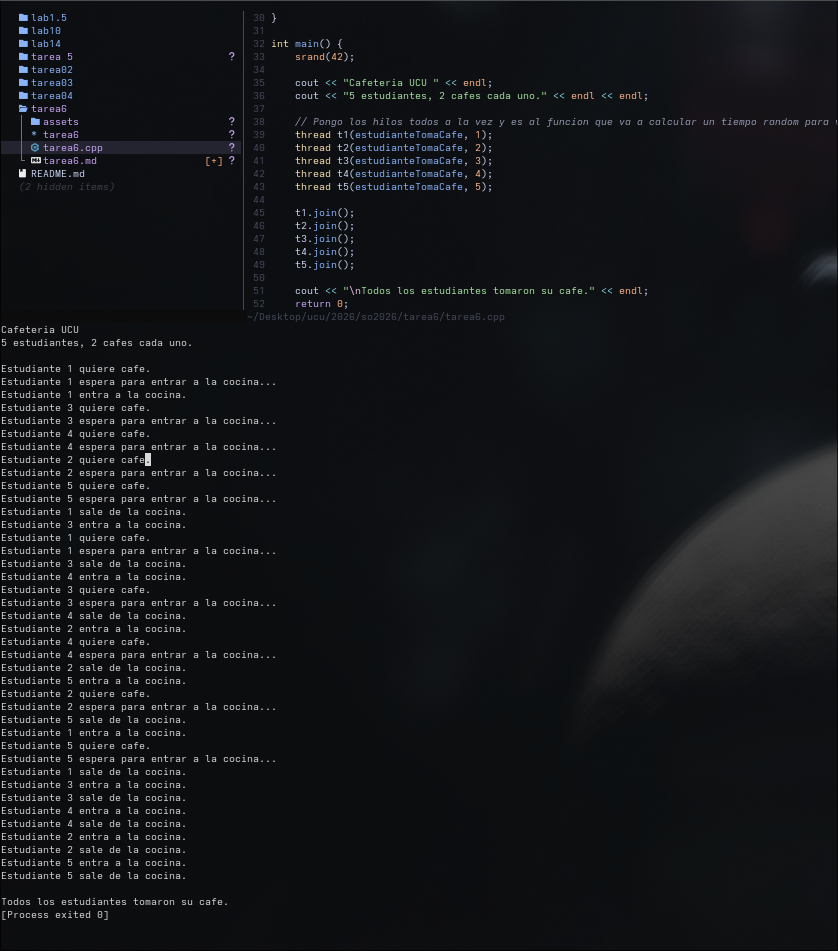

# Tarea 6 
Estudiante: Silva, Ignacio  

Universidad Católica  

Asignatura: Sistemas Operativos  

Docente: Jorge Martínez  

Fecha: 28/05/2026  


## Solución

### Mecanismo de sincronización: `mutex`

Seleccione `mutex` porque la cafetera es una sola y mientras un estudiante la esta utilizando otro no deberia poder hacerlo. Por lo que es excluyente. 

### Lógica de cada hilo

```
1. Esperar un tiempo aleatorio (para fingir que los estudiantes llegan en diferentes momentos. )
2. Anunciar que quiere café
3. Imprimir que espera para entrar a la cocina
4. Llamar a lock() — si la cafetera está ocupada, el hilo se bloquea acá hasta que se libere
5. Entrar a la cocina
6. Usar la cafetera (un tiempo random)
7. Salir de la cocina y liberar el mutex con unlock()
8. Repetir desde el paso 1 (segunda vez)
```

con esto logro esa concurrencia de que se genere esa fila en donde el primero que quiere cafe va a ser el primero en ser atendido (en este caso autoatendido)

## Captura del programa en funcionamiento

 

En este output se puede ver que:
- Nunca hay dos estudiantes en la cocina al mismo tiempo.
- Cuando la cafetera está ocupada, el resto queda en esperando.
- El acceso es ordenado: quien llega primero al mutex, entra primero.


